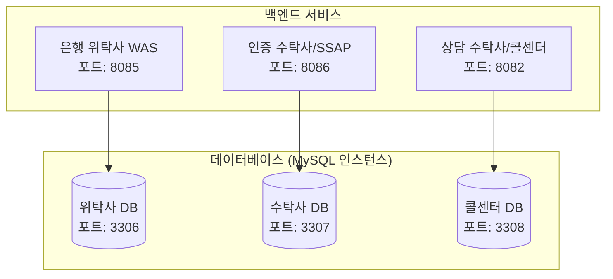

# Continue Bank - 금융 보안 플랫폼
> "금융의 중단 없는 흐름을 기술로 지킵니다."

Continue Bank는 SSAP 본인인증 시스템을 활용한 금융 서비스 플랫폼입니다. 위탁사(Continue Bank), 수탁사(SSAP 본인인증), TM 센터(콜센터) 간의 안전한 개인정보 처리 및 금융 컴플라이언스를 구현합니다.

---

## 📋 목차
- [프로젝트 개요](#🎯-프로젝트-개요)
- [시스템 아키텍처](#🏗-시스템-아키텍처)
- [주요 기능](#✨-주요-기능)
- [기술 스택](#🛠-기술-스택)
- [프로젝트 구조](#📁-프로젝트-구조)
- [시작하기](#🚀-시작하기)
- [서비스별 상세 문서](#📚-서비스별-상세-문서)

---

## 🎯 프로젝트 개요
Continue Bank는 금융 보안 컴플라이언스를 준수하 현대적인 디지털 뱅킹 플랫폼입니다.

### 핵심 가치
- **보안 우선**: 모든 개인정보는 AES-256 암호화로 보호
- **컴플라이언스**: 금융 규정 준수 (9개 필수 약관 + 4개 선택 약관)
- **투명성**: 사용자에게 명확한 데이터 처리 고지
- **신뢰**: SSAP 본인인증을 통한 안전한 신원 확인

---

## 🏗 시스템 아키텍처



### 데이터 흐름
1. **[위탁사]** 약관 동의 및 정보 입력
2. **[위탁사→수탁사]** SSAP 본인인증 요청 (인증 토큰 생성)
3. **[수탁사]** OTP 발송 및 검증 (휘발성 세션 DB 사용)
4. **[위탁사]** 회원가입 완료 (CI 기반 중복 체크 및 암호화 저장)

---

## ✨ 주요 기능

### 1. 위탁사 (Continue Bank)
#### 사용자 인증
- 회원가입 / 로그인
- 아이디 찾기 / 비밀번호 재설정
- SSAP 본인인증 연동

#### 금융 서비스
- 계좌 개설
- 대시보드
- 거래 내역 조회

#### 컴플라이언스
- 9개 필수 약관 + 4개 선택 약관 관리
- 동의 내역 조회 및 철회
- 본인인증 기록 관리
- 개인정보 처리 요청 (잊혀질 권리)

### 2. 수탁사 (SSAP 본인인증)
#### 본인인증
- 휴대폰 번호 기반 OTP 인증
- 연계정보(CI) 및 중복가입확인정보(DI) 생성
- 인증 토큰(JWT 스타일) 발급 및 검증

#### 보안 및 인프라
- AES-256 암호화 (성명, 휴대폰번호)
- TTL 기반 인증 데이터 자동 파기 (3분)
- 접속 IP 및 감사 로그 기록

#### 데이터 시뮬레이션
- 가상 통신사 가입자 데이터베이스 운영

---

## 🛠 기술 스택

### 백엔드 (Backend)
- **프레임워크**: Spring Boot 3.x
- **언어**: Java 21
- **데이터베이스**: MySQL 8.0
- **보안**: Spring Security, JWT, AES-256
- **객체 맵핑**: JPA / Hibernate

### 프론트엔드 (Frontend)
- **프레임워크**: React 18
- **빌드 도구**: Vite
- **라우팅**: React Router v6
- **스타일링**: Vanilla CSS, Tailwind CSS
- **아이콘**: Lucide React

---

## 📁 프로젝트 구조

```text
homepage-project/
├── entrusting-client/    # 위탁사 시스템 (Continue Bank)
├── trustee-provider/     # 수탁사 시스템 (SSAP 본인인증)
├── docs/                 # 기술 문서 (배포 가이드, 설계서 등)
├── infra/                # 인프라 설정 (Nginx, K8s, 보안 설정)
├── database/             # 데이터베이스 초기화 스크립트
├── start-all.bat         # 전체 서비스 통합 실행 파일
└── docker-compose.yml    # 개발 환경용 데이터베이스 구성
```

---

## 🚀 시작하기

### 사전 요구사항
- Java 21 이상
- Node.js 18 이상
- MySQL 8.0 이상

### 1. 데이터베이스 초기화
```bash
# MySQL 접속 (3306 포트)
mysql -u root -p

# 초기화 스크립트 실행
source init.sql
```

### 2. 백엔드 실행
```bash
# 위탁사 백엔드 기동
cd entrusting-client/backend
./mvnw spring-boot:run

# SSAP 백엔드 기동
cd trustee-provider/backend
./mvnw spring-boot:run
```

### 3. 프론트엔드 실행
```bash
# 위탁사 프론트엔드 (포트 5175)
cd entrusting-client/frontend
npm install
npm run dev

# SSAP 프론트엔드 (포트 5176)
cd trustee-provider/frontend
npm install
npm run dev
```

---

## 📚 서비스별 상세 문서
*   [위탁사 (Continue Bank) 기술 문서](./entrusting-client/README.md)
*   [수탁사 (SSAP 인증) 기술 문서](./trustee-provider/README.md)
*   [시스템 포트 명세 가이드](../system_port_specification.md)
*   [데이터베이스 설계 상세](../docs/DB_SCHEMA.md)
*   [개인정보 처리 흐름도](../docs/PRIVACY_FLOW_2026.md)

---

## 🔐 보안 정책 및 규준 준수

### 개인정보 보호
- **암호화**: 모든 개인정보는 AES-256-CBC 알고리즘으로 암호화됩니다.
- **키 관리**: 보안을 위해 암호화 키는 환경 변수를 통해 물리적으로 분리하여 관리합니다.

### 데이터 생애 주기
- **휘발성 데이터**: 본인인증용 세션 데이터는 3분 후 자동 파기(TTL)됩니다.
- **영구 데이터**: 고객의 약관 동의 이력 및 금융 기록은 법적 보존 기간 동안 안전하게 보관됩니다.

---

## 📄 라이선스 및 기여
- 본 프로젝트는 Continue Bank 개발팀에 의해 제작되었습니다.
- UI/UX 디자인은 토스(Toss) 스타일의 심플하고 직관적인 디자인을 참고했습니다.

---
**Continue Bank** - 기술로 금융의 신뢰를 만듭니다. 🏦

